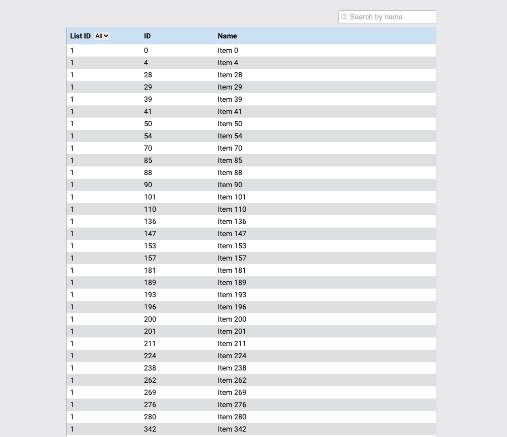

# Fetch Rewards - Front End Take Home

An application used to retrieve data from https://fetch-hiring.s3.amazonaws.com/hiring.json and display the results in a list.

## Setup

Ensure you have `node` and `npm` installed on your system.

```
$ node -v
$ npm -v
```

Clone the repository to your current working directory, and `cd fe-takehome`

```
$ git clone https://github.com/laurensingbush/fe-takehome.git
```

## Available Scripts

Installation:
`npm install`

To Run Test Suite:
`npm test`

To Start Server:
`npm start`

To Visit App:
`localhost:3000/`

## Screenshot of App



## Built with:

- [Create React App](https://github.com/facebook/create-react-app)
- [Sass](https://sass-lang.com/)
